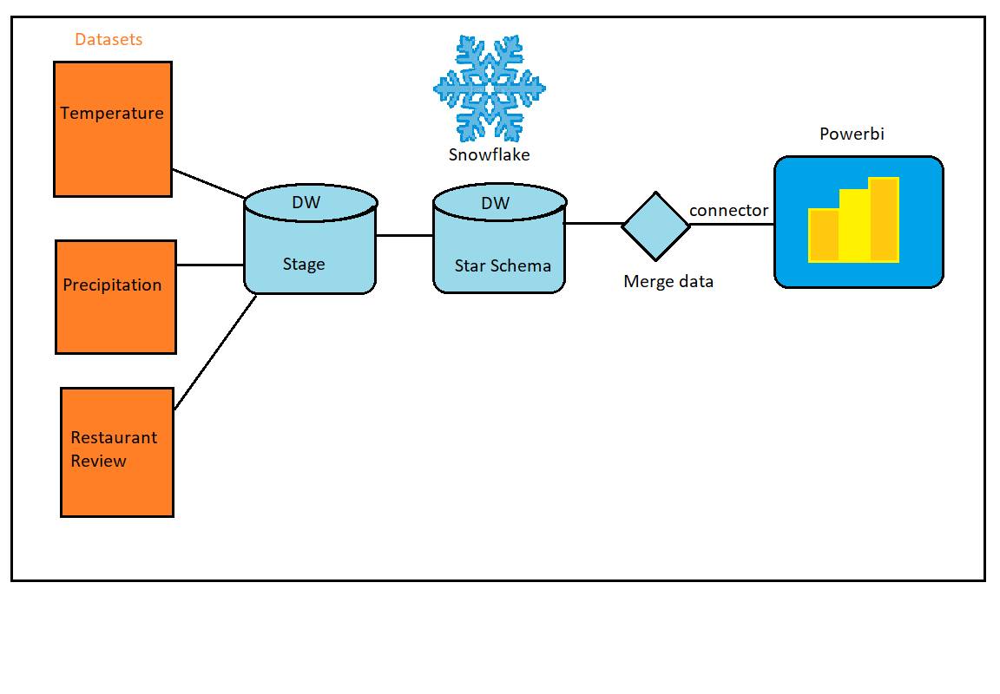
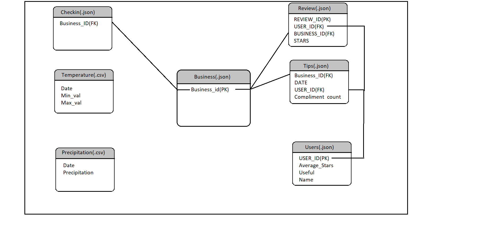
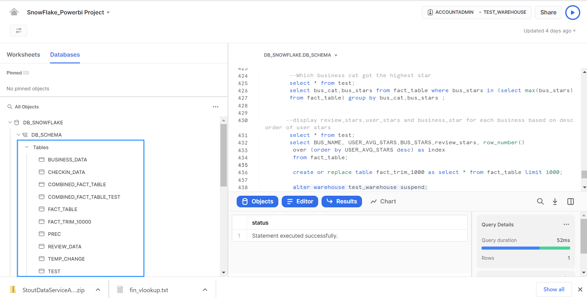

# This project focusses on  finding the effect of Temperature and Precipitation on Restaurant Sales and Review.(Tools:Snowflake,Powerbi)

#### Description : The restuarant dataset is fetched from (https://www.yelp.com/dataset/download) and the dataset for Temp/Prec observations are from the Global Historical Climatology Network-Daily (GHCN-D) database. As the datasets are from diffrent formats like json and so on, Snowflake made it  very easy to transform and load the data by creating File_formats, Staging, Pipes, Snowsql concepts directly into the table. The main object of the project was to load the data by following the star schema , find the correlation or effect of temperature on Restaurant reviews. The Data Analysis was done using Snowflake sql and Powerbi to get insights from the data. The Project also focusses on understanding key concepts in Snowflake like data loading, Resource Monitoring, Snowsql setup and usage, Streams, Role Management for Data Security, Transient Tables and many more. For Powerbi the concepts like connecting to Snowflake, Power Query Transformations, Visualizations and publishing the Dashboard were performed.

 #### Project Design

#### Star Schema (Fact and Data Tables)

#### Table structure

#### Data Analysis(EDA)
1. Powerbi Analysis
1. There are lot of duplicate data so it will be removed in Power-query transformation.
2. Remove special characters from text field.
3. Display Max/Min Temperatures State and City Wise.
iiiii. Top 5 Business having total review stars in descending order.
iiiiii. Top 10 Users who posted the Maximum Reviews
iiiiiii. Time Series plot of Total Temperature by Date
iiiiiiii. Time Series plot of Total Precipitation by Date
2.Snowflake Analysis
Top 10 users who had maximum number of useful reviews as 1 for which business category .
On which date temperature diffrence was maximum.
Fetch the top 5 dates with maximum temperature diffrence
Get the business details where the temperature distance was maximum for 5 dates.
Which business cat got the highest star?
Display review_stars,user_stars and business_star for each business based on desc order of user stars 

Result:From the above analysis there is no pattern found for business stars based on temperature change and prec value which is 4.6 .It is higher than the average precipitation value.Even with high temperatures the business was open or there is no significant impact found.
